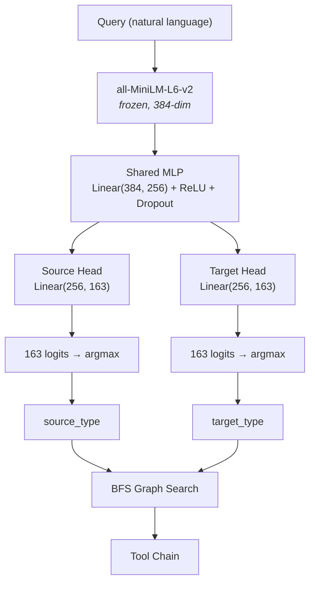

# Stripe Type Predictor

Learned entity type prediction for Typed Composition Search (TCS), demonstrated on the Stripe API (536 tools, 163 entity types).

A frozen sentence encoder (all-MiniLM-L6-v2, 22M params) with a lightweight MLP head (~182K trainable parameters) predicts source and target entity types from natural language queries. BFS graph search then resolves the predicted types to tool chains.

## Results

Evaluated with 5-fold stratified cross-validation on 3,385 training examples, tested on 42 fixed held-out queries. Stratification by source type ensures minority entity types appear in every fold.

Four strategies are compared:

- **Function calling** — All 536 tools are passed as structured function definitions. The model uses its native tool-calling mechanism to select which functions to invoke.
- **Text baseline** — All 536 tools are listed as plain text in the system prompt (`- ToolName: (InputType) → (OutputType)`). The model responds with a JSON array of tool names.
- **Zero-shot TCR** — Instead of tools, the model receives the 163 entity type names and predicts a source and target type. BFS graph search then resolves the types to a tool chain.
- **Encoder TCR** — Same as zero-shot TCR (type prediction + graph search), but type prediction is done by the trained 182K-parameter encoder instead of prompting an LLM.

For all strategies, precision, recall, and F1 are computed by comparing the predicted tool set against the expected tool set using set intersection. For TCR strategies (zero-shot and encoder), the model predicts two things — a source type and a target type — and both must be correct for the tool chain to resolve correctly. On Stripe, R_wrong=0: if either type prediction is wrong, the resolved tool chain is completely wrong (P=0, R=0 for that query).

| Strategy | Model | Precision | Recall | F1 |
|---|---|---|---|---|
| Function calling | Gemini 2.5 Pro | 0.40 | 0.40 | 0.40 |
| Function calling | Haiku 4.5 | 0.66 | 0.93 | 0.76 |
| Zero-shot TCR | Gemini 2.5 Pro | 0.36 | 0.36 | 0.36 |
| Zero-shot TCR | Haiku 4.5 | 0.82 | 0.69 | 0.74 |
| Text baseline | Haiku 4.5 | 0.85 | 0.76 | 0.79 |
| Text baseline | Gemini 2.5 Pro | 0.80 | 0.86 | 0.82 |
| **Encoder TCR** | **182K params** | **0.91 +/- 0.02** | **0.91 +/- 0.02** | **0.91 +/- 0.02** |

Per-category (mean across 5 folds):

| Category | N | Precision | Recall | F1 |
|---|---|---|---|---|
| clean | 20 | 0.92 | 0.92 | 0.92 |
| noisy | 5 | 1.00 | 1.00 | 1.00 |
| synonym | 7 | 1.00 | 1.00 | 1.00 |
| multihop | 7 | 0.87 | 0.89 | 0.88 |
| ambiguous | 3 | 0.53 | 0.53 | 0.53 |

### Gemini 2.5 Pro comparison

Gemini 2.5 Pro — a frontier model — was evaluated on the same 42 queries across all three strategies:

- **Function calling (F1=0.40)**: With 536 tools as function definitions, Gemini returns empty tool calls for most queries. The tool catalog overwhelms the model.
- **Text baseline (F1=0.82)**: Gemini's best strategy. It correctly selects tools when given the full catalog as text, but over-selects on synonym and ambiguous queries (returning multiple tools where one is expected).
- **Zero-shot TCR (F1=0.36)**: Gemini cannot infer `Platform` as a source type. It predicts `Customer→Customer`, `Refund→Refund`, `Dispute→Dispute` instead of `Platform→X` for listing queries. However, it achieves perfect scores on multihop queries (1.00) where source types are explicit.

The 182K-parameter encoder beats Gemini 2.5 Pro on every strategy. The zero-shot TCR failure is especially telling: Gemini gets 0% on noisy and 0% on Platform-source queries because it has no domain-specific knowledge of how Stripe's type graph is structured. The encoder learned this from 3,388 template-generated examples.

### Confidence threshold analysis

The model's confidence (min of source and target softmax max) is well-calibrated. At threshold 0.90, the model answers 60% of queries with perfect F1. Precision and recall move in lockstep because R_wrong=0 on Stripe — every type prediction error results in a completely wrong tool chain.

| Threshold | Coverage | P | R | F1 |
|---|---|---|---|---|
| 0.00 | 100% | 0.93 | 0.93 | 0.93 |
| 0.50 | 93% | 0.95 | 0.95 | 0.95 |
| 0.80 | 76% | 0.97 | 0.97 | 0.97 |
| 0.90 | 60% | 1.00 | 1.00 | 1.00 |

## Usage

```bash
pip install -r requirements.txt

# Train with 5-fold stratified CV (uses GPU if available)
python train.py

# Evaluate saved model on held-out test queries
python evaluate.py

# Run confidence threshold analysis
python evaluate.py --threshold-sweep
```

## Data

### Graph

`data/graph_snapshot.json` — Typed composition graph derived from the Stripe OpenAPI spec. Each tool is modeled as a typed transformation `input_types → output_types`. Entity types are extracted from request/response schemas; tools that share types create edges in the graph.

- 163 entity types, 536 tools, 250 unique (source, target) pairs

### Training data

`data/training_data.jsonl` — 3,388 template-generated examples. No LLM data augmentation. Each example is a `(query, source_type, target_type)` triple generated deterministically from the graph using seven query styles:

| Style | Examples | Description |
|---|---|---|
| template | 2,149 (63%) | Direct queries: "List all X", "Show X for this Y", "Get X details" |
| noisy | 513 (15%) | Conversational: "Something went wrong with X, can you check?" |
| question | 513 (15%) | Question form: "How many X are there?", "Which X are active?" |
| synonym | 180 (5%) | Informal terms: "payments" → PaymentIntent, "chargebacks" → Dispute |
| hard_negative | 33 (1%) | Confusing pairs: BalanceTransaction vs CustomerBalanceTransaction |

Source type distribution is heavily skewed — Platform accounts for 57% of examples (it connects to 112 of 163 target types). Sqrt-scaled class weights correct for this during training, and stratified CV ensures minority types appear in every fold.

### Test queries

`data/test_queries.json` — 42 held-out evaluation queries across 5 difficulty categories (clean, noisy, synonym, multihop, ambiguous). No overlap with training data.

## Architecture



Each head outputs 163 logits (one per entity type). Argmax selects the predicted type, softmax gives a confidence score. The minimum of source and target confidence is used as the overall prediction confidence. Both types must be correct for the tool chain to resolve correctly.

Training: 200 epochs per fold, cosine LR schedule (1e-3 -> 1e-5), sqrt-scaled class weights for source/target imbalance. Best model (by test F1) is saved.

## Conclusion

Stripe is the hardest domain for Typed Composition Search: zero-shot TCR (F1=0.74) loses to both text-based selection (0.79) and native function calling (0.76). A lightweight encoder with ~182K trainable parameters reverses this result, achieving F1=0.91 +/- 0.02.

The Gemini 2.5 Pro comparison illustrates why reformulation matters more than model scale. With 536 tools, function calling yields F1=0.40 and zero-shot type prediction yields F1=0.36 — not because the model is weak, but because the task as formulated is hard: selecting from hundreds of tools or inferring domain-specific type relationships without training examples. Gemini's best strategy (text-based selection, F1=0.82) confirms that a frontier model can partially compensate, but once the routing problem is reformulated as type prediction over a smaller label space, a domain-specific classifier becomes more effective than prompting a frontier model.

The key insight is that type prediction is the bottleneck, not graph search. On Stripe, R_wrong=0: every type prediction error produces a completely wrong tool chain, with no graceful degradation. This means recall is entirely determined by type prediction accuracy, and improving the predictor directly improves end-to-end routing. The confidence analysis confirms the model is well-calibrated — at a 0.90 threshold it achieves perfect F1 on 60% of queries, making selective prediction viable for safety-critical deployments.

More broadly, these results suggest that tool routing need not be learned end-to-end by increasingly capable foundation models. Once routing is decomposed into semantic type prediction and deterministic graph search, the learned component becomes a compact supervised classifier that can be trained independently for each domain. This opens the possibility of an ecosystem of lightweight, open-weight routing models that complement general-purpose LLMs rather than replacing them.
